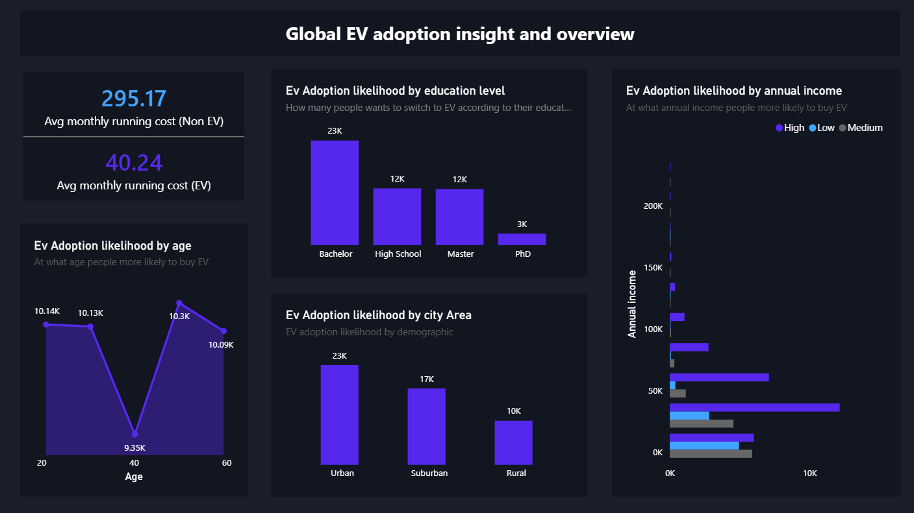

# EV-Adoption-Behavior-PowerBI
An interactive Power BI dashboard analyzing consumer psychology, demographics, and infrastructure metrics driving global EV adoption

# Global EV Adoption & Consumer Behavior Dashboard

## Project Overview
This interactive Power BI dashboard analyzes a dataset of 50,000 consumers to understand the key demographic, financial, and psychological factors driving Electric Vehicle (EV) adoption likelihood as of 2026. 

## Dashboard Preview

## Key Insight & Question Addressed
- **Target Profiles:** Which demographic brackets (Income, Education, City Type) display the highest likelihood of adopting EVs?

## Dataset Features Used
The dataset used contains 50,000 rows with 23 features, including:
- `ev_adoption_likelihood` (High, Medium, Low)
- `annual_income` & `age`
- `fuel_expense_per_month` & `monthly_charging_cost`

## Technologies Used
- **SQL:** Aggregated data column calculation
- **Pandas:** Data Cleaning and EDA
- **Power BI Desktop:** interactive visual design.

## How to View the Project
1. Download the `EV-Adoption-Behavior-PowerBI.pbix` file from this repository.
2. Open it using [Power BI Desktop](https://powerbi.microsoft.com/desktop/) to interact with the filters.
